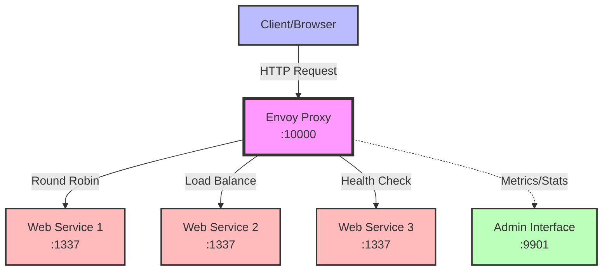
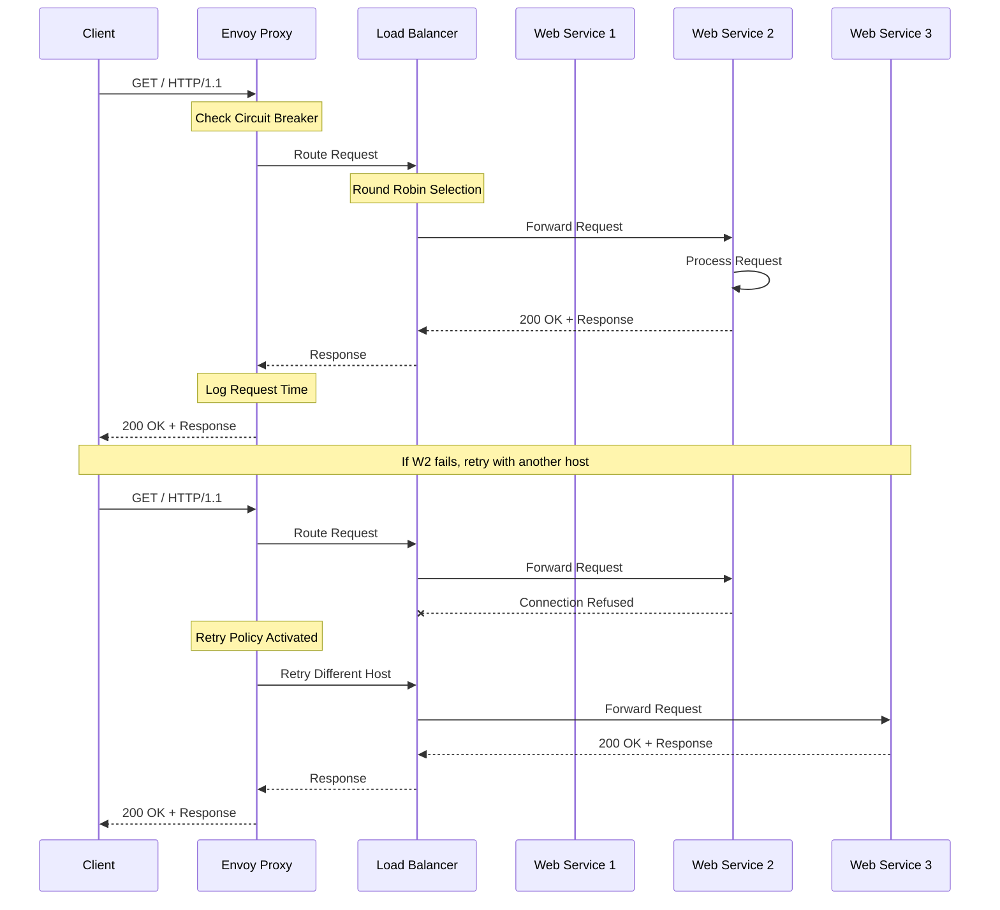
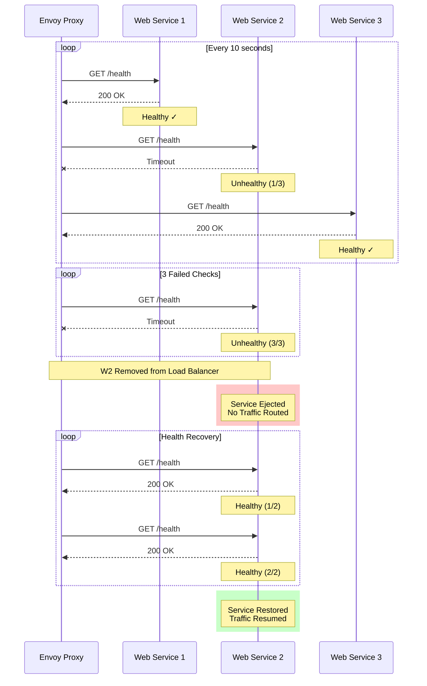
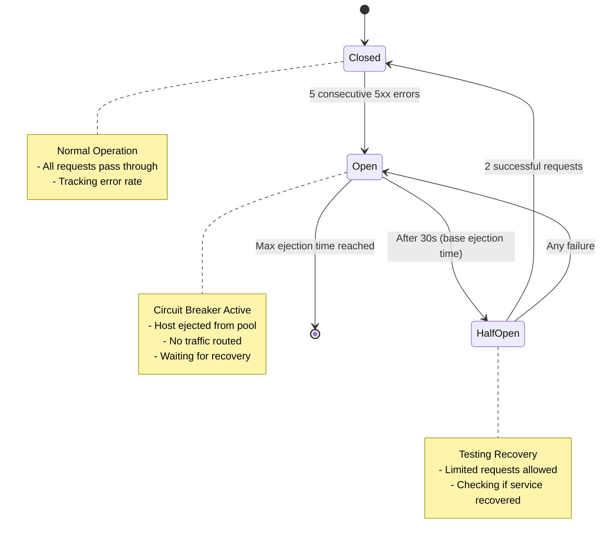
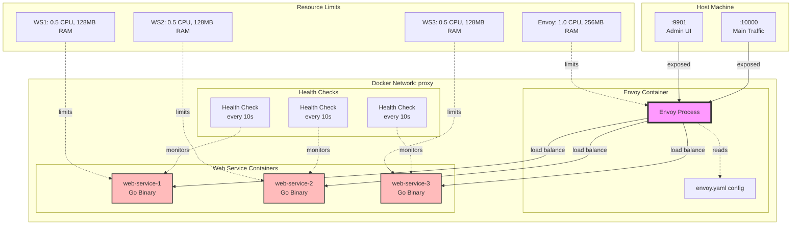
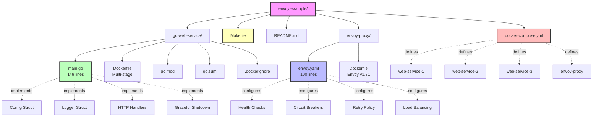
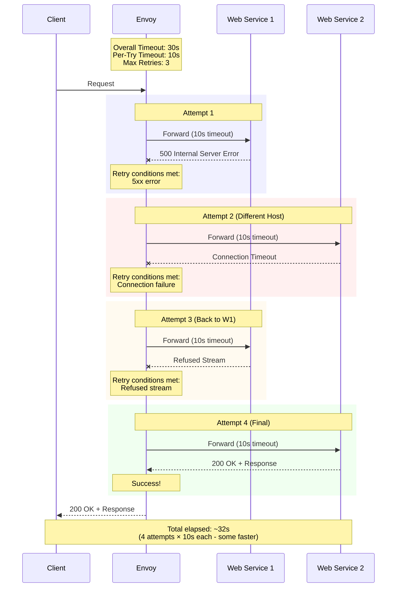
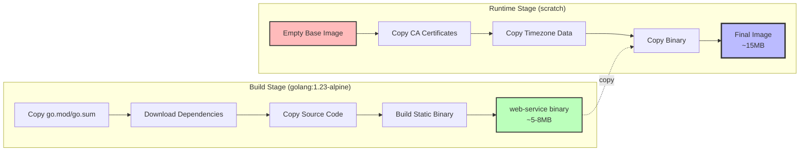
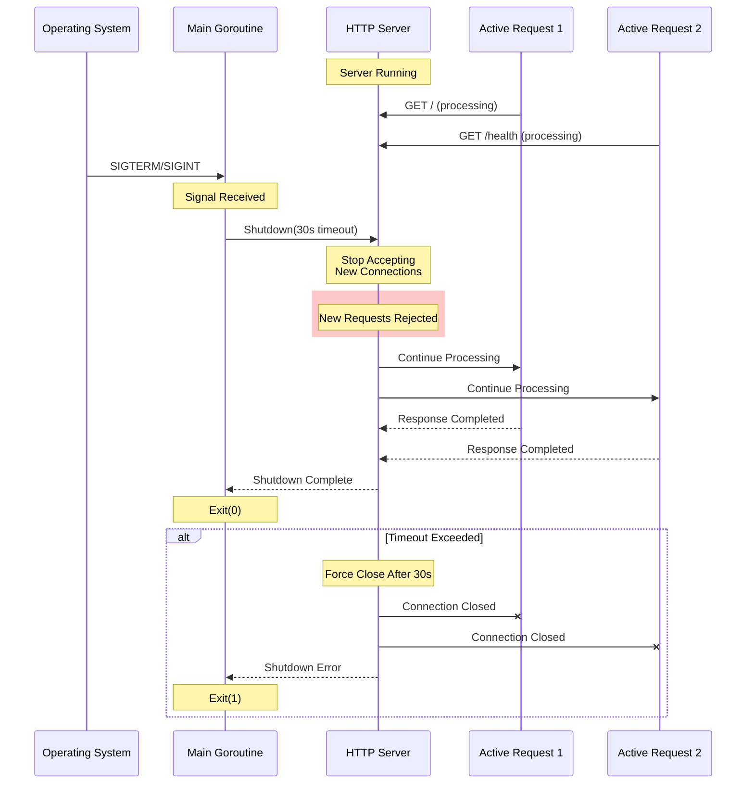

# Envoy Proxy Demo with Docker Compose

This demo showcases Envoy as an edge proxy managing traffic to multiple Go web service instances. It demonstrates load balancing, health checking, circuit breaking, and retry policies in a microservices architecture.

## Features

- **Load Balancing**: Round-robin distribution across 3 service instances
- **Health Checks**: Automatic detection and removal of unhealthy instances
- **Circuit Breaking**: Protection against cascading failures
- **Retry Logic**: Automatic retry on failures with smart host selection
- **Graceful Shutdown**: Zero-downtime deployments
- **Resource Management**: CPU and memory limits for all services
- **Structured Logging**: Comprehensive request logging
- **Optimized Images**: Multi-stage builds reducing image size by 95%

## Architecture

### System Overview



### Request Flow



### Health Check Flow



### Circuit Breaker States



### Docker Compose Deployment



## Prerequisites

- Docker and Docker Compose installed on your local machine

## Quick Start

### 1. Start All Services

```bash
docker-compose up --build
```

This will:
- Build optimized Docker images for the Go web services
- Pull and configure the latest Envoy proxy
- Start 3 web service instances with health checks
- Start Envoy with load balancing configured

### 2. Test the Setup

**Send requests through the proxy:**
```bash
curl http://localhost:10000
```

You'll see responses from different service instances:
```
Hello, World! From web-service-1
Hello, World! From web-service-2
Hello, World! From web-service-3
```

**Check health endpoint:**
```bash
curl http://localhost:10000/health
```

**View Envoy admin interface:**
```bash
curl http://localhost:9901/stats
curl http://localhost:9901/clusters
```

### 3. Stop Services

```bash
docker-compose down
```

## Project Structure



**Directory Contents:**
```
.
├── docker-compose.yml          # Orchestrates all services
├── Makefile                    # Development commands
├── README.md                   # This file
├── go-web-service/
│   ├── main.go                 # Go service with graceful shutdown
│   ├── Dockerfile              # Multi-stage optimized build
│   ├── go.mod                  # Go module definition
│   ├── go.sum                  # Dependency checksums (if any)
│   └── .dockerignore           # Build optimization
└── envoy-proxy/
    ├── envoy.yaml              # Envoy configuration
    └── Dockerfile              # Envoy container setup
```

## Configuration

### Go Web Service

The service can be configured via environment variables:
- `PORT`: Server port (default: 1337)

See `go-web-service/main.go` for the complete implementation.

### Envoy Proxy

Key features configured in `envoy-proxy/envoy.yaml`:
- **Timeouts**: 30s overall, 10s per attempt
- **Retries**: Up to 3 retries on 5xx errors and connection failures
- **Health Checks**: Every 10s with 3 unhealthy threshold
- **Circuit Breakers**: 1000 max connections, 3 max retries
- **Outlier Detection**: Ejects hosts after 5 consecutive 5xx errors

#### Retry and Timeout Configuration



**Configuration Details:**
- **Total Request Timeout**: 30 seconds maximum
- **Per-Try Timeout**: 10 seconds per attempt
- **Retry On**: 5xx errors, connection failures, refused streams
- **Max Retries**: 3 (4 total attempts)
- **Host Selection**: Avoids previously failed hosts when possible

## Advanced Usage

### View Service Logs

```bash
# All services
docker-compose logs -f

# Specific service
docker-compose logs -f web-service-1
docker-compose logs -f envoy-proxy
```

### Scale Services

```bash
# Add more instances
docker-compose up --scale web-service-1=2 -d
```

### Test Failure Scenarios

```bash
# Stop one service to test health checks
docker-compose stop web-service-1

# Requests will be routed to healthy instances
curl http://localhost:10000
```

### Monitor with Envoy Admin

- **Stats**: http://localhost:9901/stats
- **Clusters**: http://localhost:9901/clusters
- **Server Info**: http://localhost:9901/server_info
- **Config Dump**: http://localhost:9901/config_dump

## Development

### Multi-Stage Build Process



**Benefits:**
- **95% size reduction**: 300MB → 15MB
- **Layer caching**: Dependencies cached separately
- **Security**: Minimal attack surface with scratch base
- **Performance**: Faster deployments and startup

### Graceful Shutdown Flow



### Build Individual Services

```bash
# Go service
cd go-web-service
docker build -t web-service .

# Envoy proxy
cd envoy-proxy
docker build -t envoy-proxy .
```

### Run Tests

```bash
# Test Go service directly
cd go-web-service
go test ./...
```

## Production Considerations

This demo includes production-ready patterns:
- ✅ Graceful shutdown handlers
- ✅ Health check endpoints
- ✅ Structured logging
- ✅ Resource limits
- ✅ Non-root containers
- ✅ Multi-stage builds
- ✅ Retry and circuit breaking policies

For production deployment, consider adding:
- TLS/mTLS for service-to-service communication
- Distributed tracing (OpenTelemetry)
- Metrics collection (Prometheus)
- Service mesh integration (Istio/Linkerd)

## Troubleshooting

**Services won't start:**
- Check Docker daemon is running
- Ensure ports 10000 and 9901 are available

**Health checks failing:**
- Check service logs: `docker-compose logs web-service-1`
- Verify `/health` endpoint: `docker exec <container> wget -O- localhost:1337/health`

**No load balancing:**
- Verify all services are healthy: `curl localhost:9901/clusters`
- Check Envoy logs: `docker-compose logs envoy-proxy`

## References

- [Envoy Documentation](https://www.envoyproxy.io/docs)
- [Docker Compose Documentation](https://docs.docker.com/compose/)
- [Go HTTP Server Best Practices](https://golang.org/doc/articles/wiki/)
